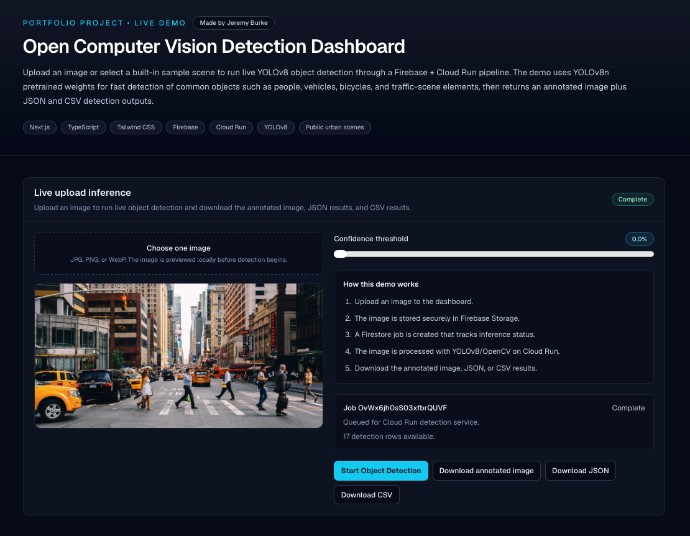
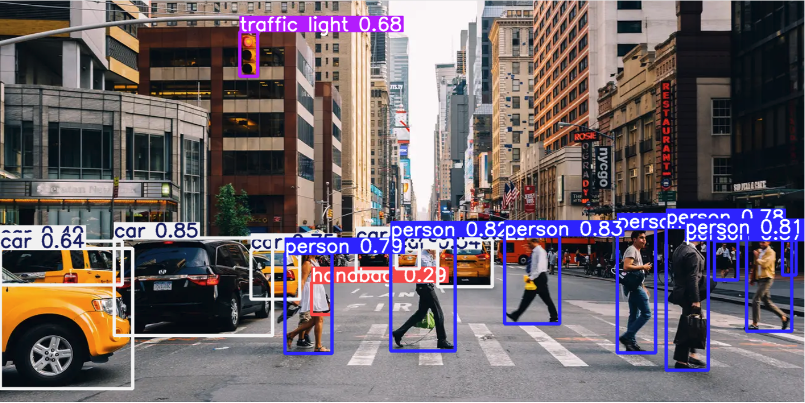
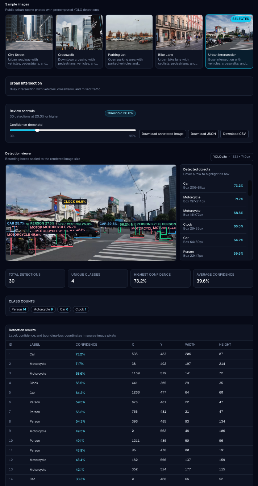

# Open Computer Vision Detection Dashboard

Made by Jeremy Burke.

A hosted computer vision demo that lets users upload an image or select a built-in sample scene, run YOLOv8 object detection, and download the results as an annotated image, JSON file, or CSV file.

The project demonstrates a full image-inference workflow: a Next.js/TypeScript frontend, Firebase Authentication, Firebase Storage, Firestore job tracking, and a Cloud Run FastAPI backend that runs YOLOv8/OpenCV inference.

## Live demo

[View the deployed dashboard](https://open-cv-detection-dashboard--open-cv-detection-dashboard.us-central1.hosted.app)

## Repository

[View the GitHub repository](https://github.com/jburke860/open-cv-detection-dashboard)

## What it does

The dashboard supports two review paths:

1. **Live upload inference**  
   Users upload a JPG, PNG, or WebP image. The app stores the image, creates an inference job, sends the job to a Cloud Run backend, runs YOLOv8 object detection, and returns downloadable detection outputs.

2. **Built-in sample image review**  
   Users can select public urban-scene sample images with precomputed YOLOv8 detections. The dashboard visualizes bounding boxes, labels, confidence scores, class counts, and detection tables directly in the browser.

The demo uses `yolov8n.pt`, a lightweight pretrained YOLOv8 model weights file. It is optimized for fast detection of common object classes such as people, cars, bicycles, motorcycles, buses, trucks, and other everyday scene objects. The pipeline can be adapted later to use custom-trained `.pt` weights for domain-specific detection.

## Screenshots

### Live upload inference



### Annotated detection output



### Detection results table



## Key features

- Hosted Next.js/TypeScript dashboard
- Live image upload workflow
- Firebase anonymous authentication
- Firebase Storage image upload
- Firestore inference job tracking
- Cloud Run FastAPI backend
- YOLOv8/OpenCV object detection
- Annotated image generation
- JSON detection output
- CSV detection output
- Downloadable result files
- Built-in public sample image gallery
- Precomputed sample detections for fast review
- Bounding-box overlays scaled to the rendered image size
- Confidence threshold filtering
- Detected-object sidebar
- Summary cards for total detections, unique classes, highest confidence, and average confidence
- Detection results table with label, confidence, and source-image coordinates

## Architecture

### Live upload inference

```text
User uploads image
        |
        v
Next.js / TypeScript frontend
        |
        v
Firebase Authentication
        |
        v
Firebase Storage stores input image
        |
        v
Firestore creates detection job
        |
        v
Cloud Run FastAPI service receives job
        |
        v
YOLOv8 / OpenCV runs object detection
        |
        v
Cloud Run writes annotated image, JSON, and CSV
        |
        v
Firebase Storage + Firestore update result status
        |
        v
User downloads detection outputs from dashboard
```

### Sample image review

```text
Public sample image
        |
        v
Precomputed YOLOv8 JSON detections
        |
        v
Next.js dashboard
        |
        v
Browser visualization
        |
        v
Bounding boxes, labels, confidence scores, summaries, and table output
```

## Tech stack

### Frontend

- Next.js
- TypeScript
- React
- Tailwind CSS

### Backend and cloud

- Firebase Authentication
- Firebase Storage
- Firestore
- Firebase App Hosting
- Google Cloud Run
- FastAPI
- Python

### Computer vision

- YOLOv8n
- Ultralytics
- OpenCV

### Outputs

- Annotated PNG image
- JSON detection file
- CSV detection table

## Project structure

```text
open-cv-detection-dashboard/
├── app/
│   ├── layout.tsx
│   ├── page.tsx
│   └── globals.css
├── components/
│   ├── Dashboard.tsx
│   ├── UploadInferencePanel.tsx
│   ├── DetectionControls.tsx
│   ├── DetectionViewer.tsx
│   ├── DetectionSummaryCards.tsx
│   ├── DetectionTable.tsx
│   └── ImageSelector.tsx
├── lib/
│   ├── detectionArtifacts.ts
│   ├── detectionPipeline.ts
│   ├── detectionTypes.ts
│   └── detectionUtils.ts
├── public/
│   ├── images/
│   └── detections/
├── scripts/
│   ├── generate_detections.py
│   └── requirements.txt
├── services/
│   └── detection-api/
│       ├── Dockerfile
│       ├── main.py
│       └── requirements.txt
├── images/
│   └── readme-screenshots/
├── firebase.json
├── firestore.rules
├── storage.rules
├── apphosting.yaml
├── .env.example
└── README.md
```

## Local setup

Clone the repository:

```bash
git clone https://github.com/jburke860/open-cv-detection-dashboard.git
cd open-cv-detection-dashboard
```

Install frontend dependencies:

```bash
npm install
```

Create a local environment file:

```bash
cp .env.example .env.local
```

Fill in the Firebase values in `.env.local`:

```text
NEXT_PUBLIC_FIREBASE_API_KEY=
NEXT_PUBLIC_FIREBASE_AUTH_DOMAIN=
NEXT_PUBLIC_FIREBASE_PROJECT_ID=
NEXT_PUBLIC_FIREBASE_STORAGE_BUCKET=
NEXT_PUBLIC_FIREBASE_MESSAGING_SENDER_ID=
NEXT_PUBLIC_FIREBASE_APP_ID=
NEXT_PUBLIC_DETECTION_API_URL=
```

Run the local app:

```bash
npm run dev
```

Open:

```text
http://localhost:3000
```

## Cloud Run detection API

The live inference backend is a FastAPI service located in:

```text
services/detection-api/
```

The service exposes:

```http
GET /health
POST /jobs
```

Example health check:

```bash
curl https://your-cloud-run-url/health
```

Expected response:

```json
{
  "ok": true
}
```

The frontend sends detection jobs to:

```http
POST /jobs
Content-Type: application/json
```

Example request body:

```json
{
  "jobId": "firestore-job-id",
  "inputPath": "detection-jobs/{uid}/{jobId}/input/image.jpg",
  "outputPrefix": "detection-jobs/{uid}/{jobId}/output",
  "confidenceThreshold": 0.25,
  "originalName": "image.jpg"
}
```

The backend downloads the image from Firebase Storage, runs YOLOv8/OpenCV inference, writes output files, and updates the Firestore job record.

Example result structure:

```json
{
  "status": "complete",
  "result": {
    "annotatedImagePath": "detection-jobs/{uid}/{jobId}/output/annotated.png",
    "jsonPath": "detection-jobs/{uid}/{jobId}/output/detections.json",
    "csvPath": "detection-jobs/{uid}/{jobId}/output/detections.csv",
    "width": 1280,
    "height": 720,
    "detections": [],
    "runtimeMs": 9880
  }
}
```

## Deploying the detection API

From the repository root:

```bash
gcloud config set project open-cv-detection-dashboard

gcloud run deploy detection-api \
  --source services/detection-api \
  --region us-east1 \
  --allow-unauthenticated \
  --memory 2Gi \
  --cpu 2 \
  --timeout 900 \
  --min-instances 0 \
  --max-instances 1 \
  --set-env-vars FIREBASE_PROJECT_ID=open-cv-detection-dashboard,FIREBASE_STORAGE_BUCKET=open-cv-detection-dashboard.firebasestorage.app,YOLO_MODEL=yolov8n.pt
```

After deployment, add the Cloud Run URL to the frontend environment:

```text
NEXT_PUBLIC_DETECTION_API_URL=https://your-cloud-run-service-url
```

## Regenerating sample detections locally

The built-in sample scenes use precomputed YOLOv8 detection JSON files stored in:

```text
public/detections/
```

To regenerate those sample detection files locally:

```bash
python3 -m venv .venv
source .venv/bin/activate
pip install -r scripts/requirements.txt
python scripts/generate_detections.py
```

On Windows:

```bash
python -m venv .venv
.venv\Scripts\activate
pip install -r scripts/requirements.txt
python scripts/generate_detections.py
```

The script reads sample images, runs YOLOv8n inference, and writes updated JSON detection files.

## Detection JSON format

Each detection file contains image metadata and object-detection results.

```json
{
  "id": "city-street",
  "image": "/images/city-street.jpg",
  "title": "City Street",
  "description": "Urban roadway with vehicles, pedestrians, and traffic signals",
  "width": 1280,
  "height": 853,
  "model": "YOLOv8n",
  "detections": [
    {
      "id": 1,
      "label": "car",
      "confidence": 0.87,
      "box": {
        "x": 420,
        "y": 180,
        "width": 120,
        "height": 340
      }
    }
  ]
}
```

Bounding-box coordinates use source-image pixels. The dashboard scales each box to match the rendered image size in the browser.

## Environment variables

Frontend variables:

```text
NEXT_PUBLIC_FIREBASE_API_KEY=
NEXT_PUBLIC_FIREBASE_AUTH_DOMAIN=
NEXT_PUBLIC_FIREBASE_PROJECT_ID=
NEXT_PUBLIC_FIREBASE_STORAGE_BUCKET=
NEXT_PUBLIC_FIREBASE_MESSAGING_SENDER_ID=
NEXT_PUBLIC_FIREBASE_APP_ID=
NEXT_PUBLIC_DETECTION_API_URL=
```

Cloud Run backend variables:

```text
FIREBASE_PROJECT_ID=
FIREBASE_STORAGE_BUCKET=
YOLO_MODEL=yolov8n.pt
```

Do not commit `.env.local` or private credentials.

## Build checks

Run these before pushing frontend changes:

```bash
npm run lint
npm run build
```

## Current scope

This project is a portfolio demo for cloud-based computer vision inference and result visualization.

Included:

- Live one-image upload inference
- Firebase-backed job creation and status tracking
- Cloud Run YOLOv8/OpenCV backend
- Annotated image, JSON, and CSV result downloads
- Public sample image review
- Browser-based bounding-box visualization

Not included:

- Live webcam inference
- Video-stream inference
- Custom-trained model weights
- Production user accounts
- Production monitoring or alerting
- Private or sensitive image workflows

## Future improvements

Potential extensions include:

- Custom-trained YOLO `.pt` model support
- Class-based filtering
- Job retry and cancellation
- Side-by-side model comparison
- Larger public sample image set
- Video or webcam inference
- Admin dashboard for reviewing job history
- Browser-side inference option using ONNX Runtime Web