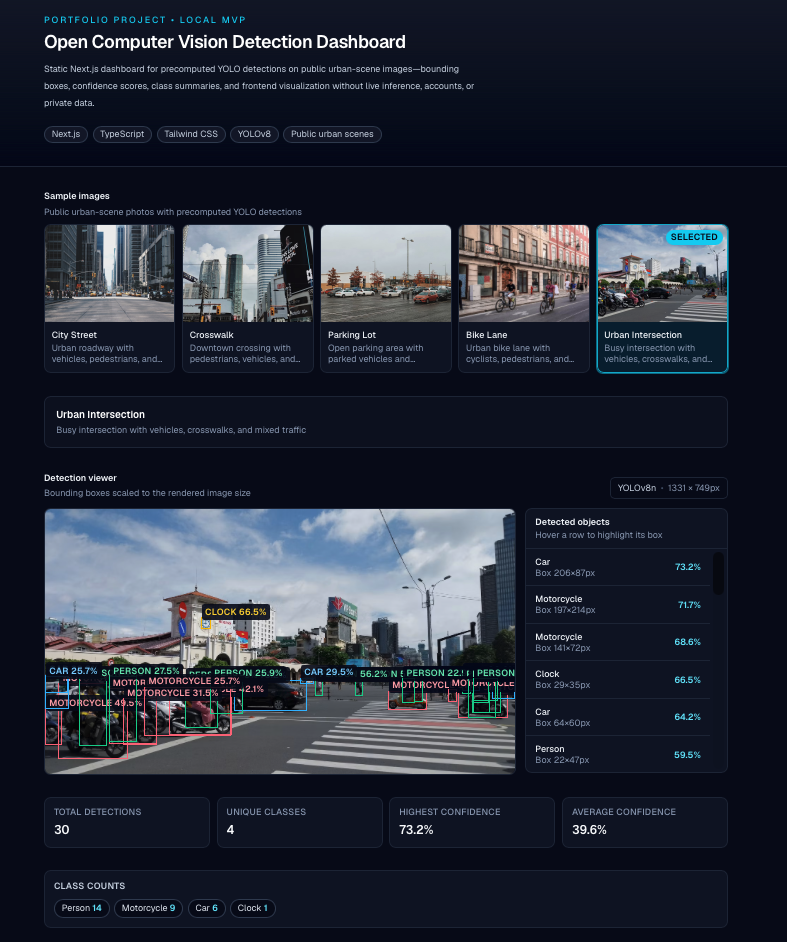
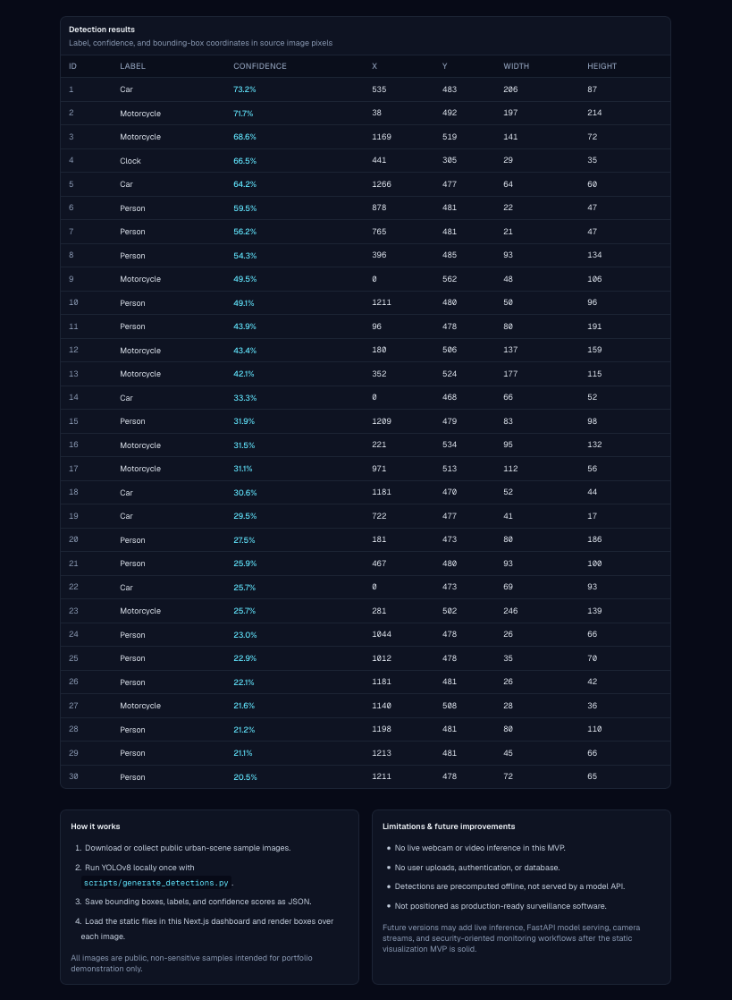
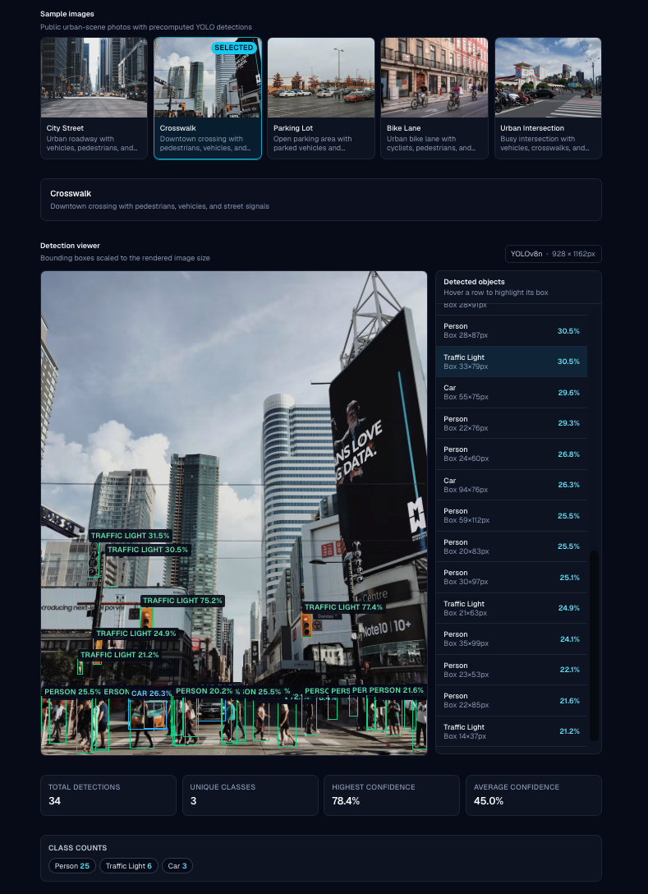

# Open Computer Vision Detection Dashboard

A static/local computer vision dashboard that visualizes **precomputed YOLO object-detection results** on public urban-scene images. Built as a portfolio MVP to demonstrate computer vision output interpretation, bounding-box rendering, confidence scoring, class summaries, and frontend dashboard engineering — without cloud deployment, user accounts, private datasets, or live model hosting.

## Why I built it

This project complements my [Technical Paper AI Search Assistant](https://github.com/jburke860/technical-paper-ai-search) portfolio build.

| Project                                      | Focus                                                                                            |
| -------------------------------------------- | ------------------------------------------------------------------------------------------------ |
| Technical Paper AI Search Assistant          | RAG, PDF processing, hybrid retrieval, local LLMs, backend APIs                                  |
| **Open Computer Vision Detection Dashboard** | Computer vision, model output visualization, bounding boxes, confidence scores, and dashboard UI |

The goal of this project is not to build a production surveillance system. The goal is to show how object-detection outputs can be inspected, visualized, and summarized in a clean technical interface.

## Screenshots

### Dashboard UI — Detection Viewer



### Dashboard UI — Detection Results



### Example Image Selection



## Current features

* Public urban-scene image gallery
* Precomputed YOLOv8 detection JSON files
* Detection viewer with scaled bounding boxes
* Object labels and confidence scores rendered over images
* Hoverable detected-object list synced with box highlights
* Summary cards for:

  * total detections
  * unique classes
  * highest confidence detection
  * average confidence
* Class count chips
* Detection results table with label, confidence, and source-image box coordinates
* “How it works” and limitations sections
* Optional Python script to regenerate detections locally

## Architecture

```text
Public urban-scene images
        │
        ▼
Local YOLOv8 inference script
        │
        ▼
Precomputed JSON detection files
        │
        ▼
Next.js dashboard
        │
        ▼
Browser visualization
Bounding boxes · labels · confidence scores · summary cards · results table
```

## Tech stack

* **Next.js** with App Router
* **TypeScript**
* **Tailwind CSS**
* **Static JSON detection artifacts**
* **YOLOv8n** through Ultralytics for optional local detection generation
* **Public, non-sensitive sample images**

## Project structure

```text
open-cv-detection-dashboard/
├── app/
│   ├── layout.tsx
│   ├── page.tsx
│   └── globals.css
├── components/
│   ├── Dashboard.tsx
│   ├── DetectionViewer.tsx
│   ├── DetectionSummaryCards.tsx
│   ├── DetectionTable.tsx
│   └── ImageSelector.tsx
├── lib/
│   ├── detectionTypes.ts
│   └── detectionUtils.ts
├── public/
│   ├── images/
│   └── detections/
├── data/
│   └── sample_images/
├── scripts/
│   ├── generate_detections.py
│   └── requirements.txt
├── images/
│   └── readme-screenshots/
└── README.md
```

## Local setup

Clone the repository and install dependencies:

```bash
git clone https://github.com/jburke860/open-cv-detection-dashboard.git
cd open-cv-detection-dashboard
npm install
npm run dev
```

Open the local app:

```text
http://localhost:3000
```

## Production build

```bash
npm run build
npm start
```

## How detections were generated

The dashboard uses **precomputed object-detection results**. This keeps the MVP lightweight and easy to run because reviewers do not need a GPU, model server, database, or cloud deployment.

The workflow is:

1. Collect public urban-scene sample images.
2. Run YOLOv8 locally using the optional Python script.
3. Save bounding boxes, labels, confidence scores, and image metadata as JSON.
4. Load the static JSON files in the Next.js dashboard.
5. Render bounding boxes and detection summaries in the browser.

To regenerate detections locally:

```bash
python3 -m venv .venv
source .venv/bin/activate
pip install -r scripts/requirements.txt
python scripts/generate_detections.py
```

On Windows:

```bash
python -m venv .venv
.venv\Scripts\activate
pip install -r scripts/requirements.txt
python scripts/generate_detections.py
```

The script reads sample images, runs YOLOv8n inference locally, and writes detection files to:

```text
public/detections/
```

## Detection JSON format

Each image has a matching JSON file containing image metadata and detection results.

```json
{
  "id": "city-street",
  "image": "/images/city-street.jpg",
  "title": "City Street",
  "width": 1280,
  "height": 853,
  "model": "YOLOv8n",
  "detections": [
    {
      "id": 1,
      "label": "car",
      "confidence": 0.87,
      "box": {
        "x": 420,
        "y": 180,
        "width": 120,
        "height": 340
      }
    }
  ]
}
```

Bounding-box coordinates use **source image pixels**. The dashboard scales each box to match the rendered image size in the browser.

## Example workflow

1. Select a public urban-scene image from the gallery.
2. Inspect the bounding boxes and confidence labels overlaid on the image.
3. Review the detected-object sidebar.
4. Compare summary cards for total detections, unique classes, highest confidence, and average confidence.
5. Browse the full detection table for class labels, confidence scores, and box coordinates.

## Current MVP scope

This is intentionally a **static/local MVP**.

Included:

* Public sample images
* Precomputed YOLO detections
* Static JSON files
* Browser-based visualization
* Local dashboard workflow

Not included:

* live webcam inference
* user uploads
* authentication
* database storage
* production monitoring
* cloud model hosting
* private or sensitive image data

## Limitations

* Detection quality depends on the chosen sample images, YOLOv8n model behavior, and confidence threshold.
* Some low-confidence detections may be imperfect.
* The dashboard visualizes precomputed detections rather than running live inference in the browser.
* The project is not positioned as production-ready surveillance or security software.
* The image set is intentionally small to keep the MVP focused and easy to review.

## Future improvements

Potential future extensions include:

* Live video or webcam inference
* FastAPI backend for model serving
* Confidence threshold slider
* Class-based filtering
* Side-by-side model comparison
* Detection export tools
* Larger public urban-scene image set
* Optional security-oriented monitoring workflows after the static visualization MVP is complete

## Image attribution

Sample images are public, non-sensitive urban-scene images used for portfolio demonstration. If image sources require attribution, list them here before publishing the repository.
