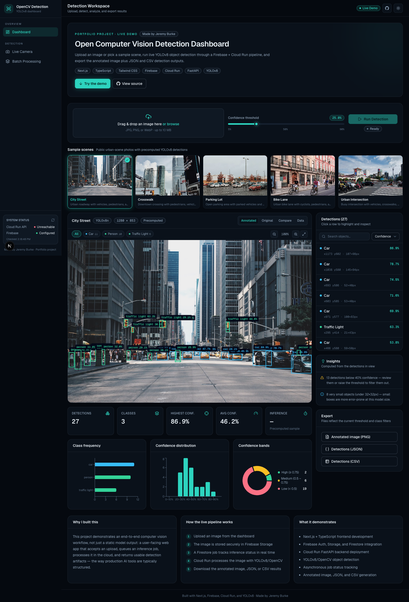
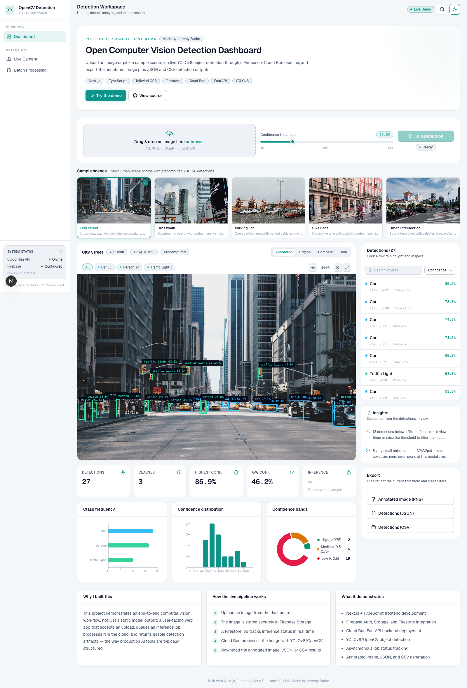
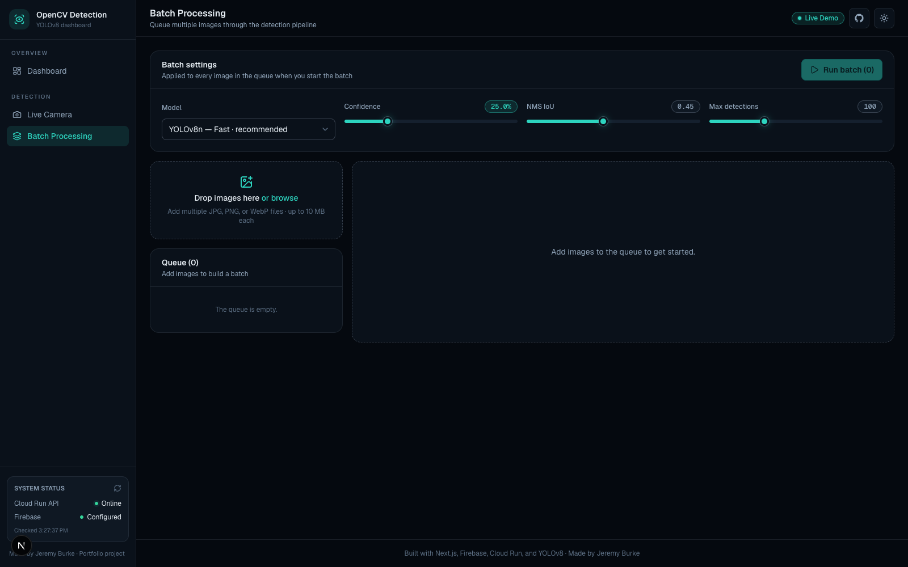
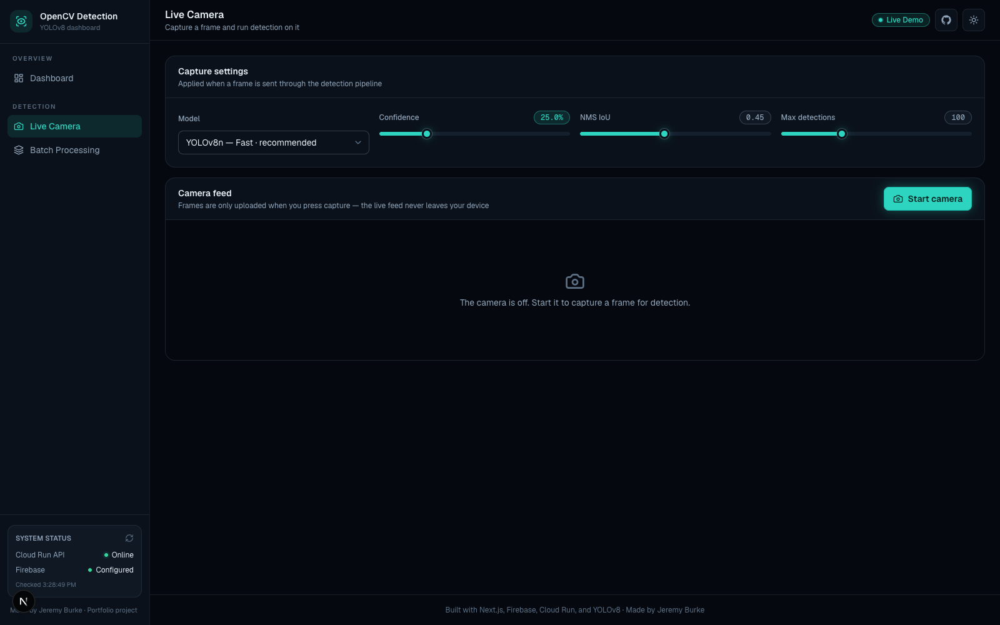

# Open Computer Vision Detection Dashboard

Made by Jeremy Burke.

A hosted computer vision demo that lets users upload an image, capture a webcam frame, or batch-process multiple images, run YOLOv8 object detection, and explore the results in an interactive workspace — with annotated image, JSON, and CSV exports.

The project demonstrates a full image-inference workflow: a Next.js/TypeScript frontend with a dark/light themed dashboard UI, Firebase Authentication, Firebase Storage, Firestore job tracking, and a Cloud Run FastAPI backend that runs YOLOv8/OpenCV inference.

## Live demo

[View the deployed dashboard](https://open-cv-detection-dashboard--open-cv-detection-dashboard.us-central1.hosted.app)

## What it does

The dashboard has three detection surfaces, all rendered through one unified result workspace:

1. **Detection workspace (live upload + samples)**
   Upload a JPG, PNG, or WebP image, pick a model, tune the confidence threshold, NMS IoU, and max detections, and run live inference on Cloud Run. Or select one of the built-in urban sample scenes with precomputed YOLOv8 detections.

2. **Batch processing**
   Queue multiple images and run them through the pipeline with limited concurrency. Each item reports upload, processing, and completion state, and the page aggregates detection totals across the batch.

3. **Live camera**
   Start the webcam, capture a single frame, and send it through the same detection pipeline. The live feed never leaves the device — only captured frames are uploaded.

Every result opens in the same explorer: Original / Annotated / Compare / Data viewer tabs, zoom and fullscreen, class filter chips, a searchable and sortable detections panel with a per-detection inspector, real computed analytics (class frequency, confidence histogram, confidence bands), rule-based insights, and client-side exports that reflect the current filters.

The demo uses `yolov8n.pt` and `yolov8s.pt`, pretrained YOLOv8 weights optimized for common object classes such as people, cars, bicycles, motorcycles, buses, trucks, and other everyday scene objects.

## Screenshots

### Detection workspace (dark theme)



### Detection workspace (light theme)



### Batch processing



### Live camera



## Key features

- Hosted Next.js/TypeScript dashboard with sidebar navigation
- Dark "command center" theme with a full light theme toggle
- Model picker (YOLOv8n fast / YOLOv8s balanced)
- Confidence threshold, NMS IoU threshold, and max-detections controls passed to real inference
- Live image upload workflow with drag & drop
- Batch upload queue with limited concurrency and aggregate stats
- Webcam single-frame capture through the same pipeline
- Unified client-side viewer: Original / Annotated / Compare slider / raw Data tabs
- Zoom, fullscreen, class filter chips, and hover-synced bounding boxes
- Searchable, sortable detections panel with per-detection inspector
- Real computed analytics: class frequency, confidence histogram, confidence bands
- Rule-based insights derived from the detections in view
- Annotated image, JSON, and CSV exports reflecting the current filters
- Raw Cloud Run artifacts (annotated.png, detections.json, detections.csv) downloadable for uploads
- Live system status (Cloud Run health check + Firebase config) in the sidebar
- Firebase anonymous authentication with ID-token-verified backend calls
- Firestore inference job tracking with TTL cleanup
- One-day storage lifecycle cleanup for uploads and outputs

## Architecture

### Live upload inference

```text
User uploads image (workspace, batch, or camera)
        |
        v
Next.js / TypeScript frontend
        |
        v
Firebase anonymous authentication
        |
        v
Firebase Storage stores input image under detection-jobs/{uid}/{jobId}/input/
        |
        v
Firestore job document created with all inference parameters
(model, confidence, IoU, max detections)
        |
        v
Frontend calls Cloud Run POST /jobs with { jobId } + Firebase ID token
        |
        v
Cloud Run verifies the token, loads the job document, and checks that
the caller owns the job and its storage paths
        |
        v
YOLOv8 / OpenCV inference (yolov8n or yolov8s)
        |
        v
Cloud Run writes annotated image, JSON, and CSV to Storage
        |
        v
Firestore job updated with results; the dashboard listens in real time
        |
        v
User explores results and downloads detection outputs
```

The Cloud Run service never trusts request-body parameters: everything except the job ID comes from the Firestore document, which is created under Firestore security rules, and the caller must present a Firebase ID token matching the job's `ownerId`.

### Sample image review

```text
Public sample image
        |
        v
Precomputed YOLOv8 JSON detections
        |
        v
Next.js dashboard
        |
        v
Same client-side viewer as live uploads
(bounding boxes, filters, analytics, exports)
```

## Tech stack

### Frontend

- Next.js
- TypeScript
- React
- Tailwind CSS
- next-themes (dark/light theming)
- Recharts (analytics charts)
- lucide-react (icons)

### Backend and cloud

- Firebase Authentication
- Firebase Storage
- Firestore
- Firebase App Hosting
- Google Cloud Run
- FastAPI
- Python

### Computer vision

- YOLOv8n and YOLOv8s
- Ultralytics
- OpenCV

### Outputs

- Annotated PNG image
- JSON detection file
- CSV detection table

## Project structure

```text
open-cv-detection-dashboard/
├── app/
│   ├── layout.tsx
│   ├── page.tsx            # detection workspace
│   ├── batch/page.tsx      # batch processing
│   ├── camera/page.tsx     # live camera capture
│   └── globals.css         # theme tokens (dark + light)
├── components/
│   ├── shell/              # sidebar, topbar, theme toggle, system status
│   ├── ui/                 # Card, Button, Badge, Slider, Tabs, Select, ...
│   ├── workspace/          # viewer, panels, upload controls, hero
│   ├── batch/              # batch queue workspace
│   └── camera/             # camera capture workspace
├── lib/
│   ├── detectionPipeline.ts    # Firebase + Cloud Run client pipeline
│   ├── useDetectionJobRunner.ts
│   ├── useBatchQueue.ts
│   ├── useSystemStatus.ts
│   ├── detectionArtifacts.ts   # client-side exports
│   ├── detectionTypes.ts
│   ├── detectionUtils.ts
│   └── workspaceTypes.ts
├── public/
│   ├── images/             # sample scenes
│   └── detections/         # precomputed sample detections
├── scripts/
│   ├── generate_detections.py
│   └── requirements.txt
├── services/
│   └── detection-api/
│       ├── Dockerfile
│       ├── main.py
│       └── requirements.txt
├── images/
│   └── readme-screenshots/
├── firebase.json
├── firestore.rules
├── storage.rules
├── apphosting.yaml
├── .env.example
└── README.md
```

## Local setup

Clone the repository:

```bash
git clone https://github.com/jburke860/open-cv-detection-dashboard.git
cd open-cv-detection-dashboard
```

Install frontend dependencies:

```bash
npm install
```

Create a local environment file:

```bash
cp .env.example .env.local
```

Fill in the Firebase values in `.env.local`:

```text
NEXT_PUBLIC_FIREBASE_API_KEY=
NEXT_PUBLIC_FIREBASE_AUTH_DOMAIN=
NEXT_PUBLIC_FIREBASE_PROJECT_ID=
NEXT_PUBLIC_FIREBASE_STORAGE_BUCKET=
NEXT_PUBLIC_FIREBASE_MESSAGING_SENDER_ID=
NEXT_PUBLIC_FIREBASE_APP_ID=
NEXT_PUBLIC_DETECTION_API_URL=
```

Run the local app:

```bash
npm run dev
```

Open:

```text
http://localhost:3000
```

## Cloud Run detection API

The live inference backend is a FastAPI service located in:

```text
services/detection-api/
```

The service exposes:

```http
GET /health
POST /jobs
```

Example health check:

```bash
curl https://your-cloud-run-url/health
```

Expected response:

```json
{
  "ok": true,
  "models": ["yolov8n", "yolov8s"]
}
```

The frontend sends detection jobs to:

```http
POST /jobs
Content-Type: application/json
Authorization: Bearer <firebase-id-token>
```

Request body:

```json
{
  "jobId": "firestore-job-id"
}
```

All inference parameters — model, confidence threshold, NMS IoU threshold, max detections, input path, and output prefix — are read from the Firestore job document, never from the request body. The service verifies the Firebase ID token and rejects the request unless the token's `uid` matches the job's `ownerId` and the job's storage paths live under `detection-jobs/{uid}/`.

Example result structure written back to Firestore:

```json
{
  "status": "complete",
  "result": {
    "annotatedImagePath": "detection-jobs/{uid}/{jobId}/output/annotated.png",
    "jsonPath": "detection-jobs/{uid}/{jobId}/output/detections.json",
    "csvPath": "detection-jobs/{uid}/{jobId}/output/detections.csv",
    "width": 1280,
    "height": 720,
    "model": "YOLOv8n",
    "detections": [],
    "runtimeMs": 9880,
    "iouThreshold": 0.45,
    "maxDetections": 100
  }
}
```

## Deploying the detection API

All model weights (YOLOv8 n/s, YOLO11 n/s, YOLO12n, RT-DETR-L, YOLOv8s-World plus its CLIP text encoder) are baked into the Docker image at build time, so cold starts never download them.

From the repository root:

```bash
gcloud config set project open-cv-detection-dashboard

gcloud run deploy detection-api \
  --source services/detection-api \
  --region us-east1 \
  --allow-unauthenticated \
  --memory 4Gi \
  --cpu 2 \
  --timeout 900 \
  --min-instances 0 \
  --max-instances 1 \
  --set-env-vars FIREBASE_PROJECT_ID=open-cv-detection-dashboard,FIREBASE_STORAGE_BUCKET=open-cv-detection-dashboard.firebasestorage.app
```

After deployment, add the Cloud Run URL to the frontend environment:

```text
NEXT_PUBLIC_DETECTION_API_URL=https://your-cloud-run-service-url
```

## Storage lifecycle cleanup

Live uploads and generated outputs are written under:

```text
detection-jobs/{uid}/{jobId}/
```

The `storage.lifecycle.json` file configures Cloud Storage to delete objects under
`detection-jobs/` after 1 day. Apply it from the repository root:

```bash
gcloud config set project open-cv-detection-dashboard

gcloud storage buckets update gs://open-cv-detection-dashboard.firebasestorage.app \
  --lifecycle-file=storage.lifecycle.json
```

Verify the active bucket lifecycle config:

```bash
gcloud storage buckets describe gs://open-cv-detection-dashboard.firebasestorage.app \
  --format="default(lifecycle_config)"
```

Lifecycle changes can take up to 24 hours to take effect. If you add other bucket
lifecycle rules later, include them in `storage.lifecycle.json` before applying it.

## Firestore document cleanup

New `detectionJobs` documents include an `expireAt` timestamp set 1 day after job
creation. Enable Firestore TTL once so Firestore automatically deletes expired
job documents:

```bash
gcloud config set project open-cv-detection-dashboard

gcloud firestore fields ttls update expireAt \
  --collection-group=detectionJobs \
  --enable-ttl
```

Verify the TTL policy:

```bash
gcloud firestore fields ttls list --collection-group=detectionJobs
```

Deploy the Firestore security rules:

```bash
firebase deploy --only firestore:rules
```

TTL deletion is not instant; expired documents are typically deleted within 24
hours after their expiration time. Documents without `expireAt` are not deleted
by TTL, so old test documents created before this field existed can be deleted
manually from the Firebase console if needed.

## Regenerating sample detections locally

The built-in sample scenes use precomputed YOLOv8 detection JSON files stored in:

```text
public/detections/
```

To regenerate those sample detection files locally:

```bash
python3 -m venv .venv
source .venv/bin/activate
pip install -r scripts/requirements.txt
python scripts/generate_detections.py
```

On Windows:

```bash
python -m venv .venv
.venv\Scripts\activate
pip install -r scripts/requirements.txt
python scripts/generate_detections.py
```

The script reads sample images, runs YOLOv8n inference, and writes updated JSON detection files.

## Detection JSON format

Each detection file contains image metadata and object-detection results.

```json
{
  "id": "city-street",
  "image": "/images/city-street.jpg",
  "title": "City Street",
  "description": "Urban roadway with vehicles, pedestrians, and traffic signals",
  "width": 1280,
  "height": 853,
  "model": "YOLOv8n",
  "generatedBy": "scripts/generate_detections.py",
  "detections": [
    {
      "id": 1,
      "label": "car",
      "confidence": 0.93,
      "box": { "x": 117, "y": 620, "width": 176, "height": 203 }
    }
  ]
}
```
